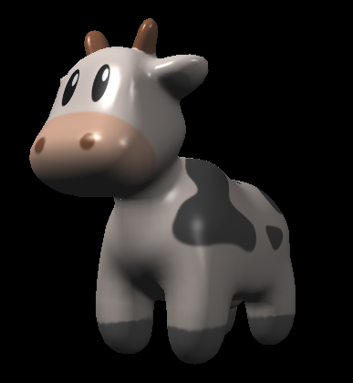
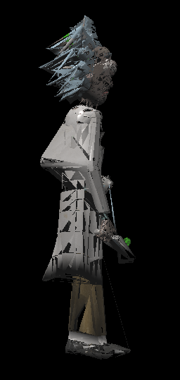
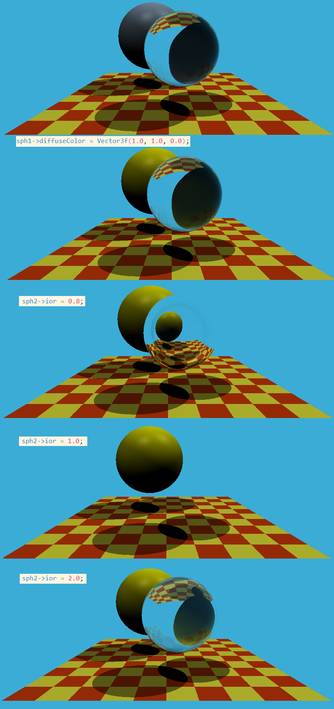

<big>感谢闫老师的精彩课程嘿嘿嘿</big>

# GAMES101

## Assignment 3

### FYI

- 如果换新的模型没有渲染出来，可以调整main函数中的`eye_pos`参数, 让相机离物体远一点

### To Be Fixed

- [ ] 加了多线程后有的三角形没渲染出来

- [ ] 图片是绝对地址，使用相对地址就找不到

- [ ] 换上新的模型(rick/Rick.obj)很多三角形连在一起

  

## Assignment 5

